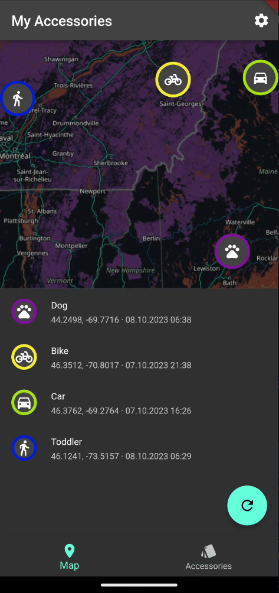

## Introduction

This project tries to unify several projects for simpler handling of custom BT-devices with Apple's FindMy network. The goal is to run a headless MacOS without the need to have a real Mac and have to install mail plugins or openhaystack itself.

***This is project is just a playground for checking technical feasibility and should not be used otherwise.***

Included projects are (Credits goes to them for the hard work):
- The original [Openhaystack](https://github.com/seemoo-lab/openhaystack)
    - Android application 
    - ESP32 firmware
- [Biemster's FindMy](https://github.com/biemster/FindMy)
    - The standalone python webserver for fetching the FindMy reports
- [Positive security's Find you](https://github.com/positive-security/find-you)
    - ESP32 firmware customization for battery optimization 
- [acalatrava's OpenHaystack-Fimware alternative](https://github.com/acalatrava/openhaystack-firmware)
    - NRF5x firmware customization for battery optimization 
- Optional: Dockerized MacOS by [Sickcodes](https://github.com/sickcodes/Docker-OSX)
- Optional: mac OS serial generator by [Sickcodes](https://github.com/sickcodes/osx-serial-generator)

## Changes to the original projects

### Openhaystack

Stripped down to the mobile application (Android) and ESP32 firmware. ESP32 firmware combined with FindYou project and optimizations in power usage. 
 

### Biemster's FindMy

Customization in keypair generator to output an array for the ESP32 firmware and a json for import in the Android application. 

## Instructions

- Host: [Set up your virtual or real MAC](OSX-KVM/README.md)
- Install python dependencies `pip install cryptography argparse pyobjc six` (pip command depends on your version and installation)
- Host or MacOS-Guest: Run `generate_keys.py` (check the projects webserver-folder) to generate your key (e.g. `./generate_keys.py -p PREFIX`). All files will be in output-folder (All keys as information, PREFIX_keyfile for ESP32 and PREFIX_devices.json for import in application)
- Host: [Install ESP32-firmware with your key](firmware/ESP32/README.md) or/and (see note)
- Host: [Install NRF5x-firmware with your key](firmware/nrf5x/README.md) (see note)
- *Optional*: Mobile: Install application
- *Optional*: Host: Browse to [Github Page](https://dchristl.github.io/macless-haystack/) (s. [Notes on SSL usage](OSX-KVM/README.md#notes-on-usage-on-other-machines-ssl))
- *Optional*: Host: Browse to [http://localhost:56443/](http://localhost:56443/)
- Mobile or Host: Import PREFIX_devices.json to your  application

> [!NOTE]  
> In general, any OpenHaystack-compatible device or its firmware is also compatible with HeadlessHaystack (i.e. [the ST17H66](https://github.com/biemster/FindMy/tree/main/Lenze_ST17H66)). Typically, only the Base64-encoded advertisement key is required, which can be found in the .keys file after key generation.

## Screenshots

### Android

### Web

